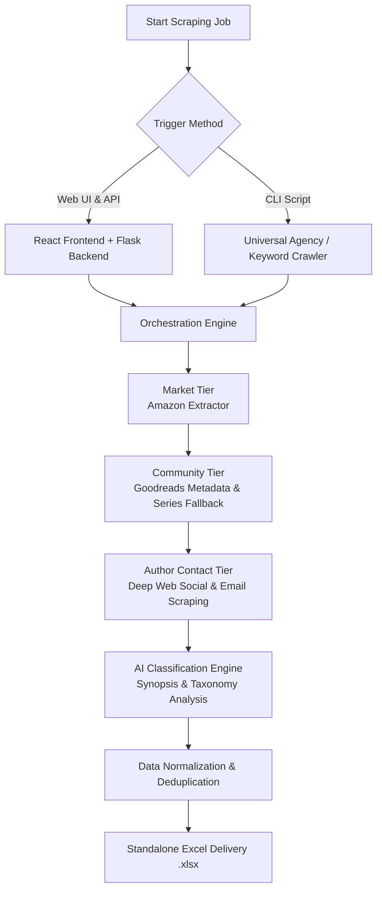

# PocketFM Scraper & Automation Engine

The PocketFM Scraper & Automation Engine is an industrial-grade intelligence, classification, and CRM automation suite. It is designed to harvest, validate, classify, upload, and track literary content entirely autonomously.

## 🚀 Unlimited Scaling & Versatility

Built for **infinite discovery** and adaptability:
- **Universal Agency Ingestion**: Point the industrial engine at any literary agency catalog to generate a standalone, formatted report without needing custom scripts per agency.
- **Bestseller & Keyword Scraping**: Dynamic targeting per genre, per attribute, or via custom search keywords.
- **RESTful API & Web UI**: Features a Flask-based REST API backend integrated with a React 19 / Vite frontend for seamless mission control and monitoring.
- **Multi-Genre Support**: Seamlessly classifies Romantasy, Paranormal Romance, Werewolves, or any other niche market via AI classification.
- **Attribute-Level Control**: Fine-tune extraction to target specific data points like price, series info, or author contact details.

## 💎 Premium Features

- **Industrial Orchestration Engine**: Automated multi-batch processing with state persistence (`_state.json`), auto-saving, and intelligent rate-limiting/block-bypassing to ensure continuous operation.
- **Multi-Tiered Discovery Intelligence**: 
    - **Market Tier (Amazon)**: Deep extraction of bestseller ranks, pricing, series hierarchy, and publication details.
    - **Community Tier (Goodreads)**: Advanced fallback logic to resolve series URLs, primary book counts, and ratings.
    - **Author Contact Tier**: Automated discovery of official websites, social media (FB/IG/X), and professional agent representation via deep web scraping.
- **Automated AI Subgenre Classification**: Intelligent Romantasy/Subgenre classification analyzing synopses and tags to automatically categorize books.
- **Standalone Excel Delivery**: Generates dedicated, standalone `.xlsx` workbooks with advanced formatting (Text Wrapping, Top-Alignment, and Professional Header Styling) ready for Google Sheets or CRM integration.
- **Automated Google Drive Uploads**: Bypasses API limitations utilizing persistent browser automation (`browser_profile_master`) to perform invisible, high-speed bulk uploads straight into enterprise Google Drive folders, seamlessly pulling shareable links back into local Excel trackers.

## ⚙️ Scraping & Automation Workflow

The platform orchestrates a seamless end-to-end data extraction and enrichment pipeline, ensuring maximum data fidelity through intelligent fallbacks and cross-validation.



## 🖥️ System Usage

### 1. Web Application Mode (API + UI)
Launch the full-stack application to run scraping jobs via the frontend UI.
```bash
# From the root directory, start both frontend and backend concurrently
npm run dev
```
*   **Features**: REST endpoints (`/api/scrape-bestsellers`, `/api/download`), interactive Playwright sessions, and automated background processing.

### 2. Universal Agency Mission Control
Run the universal agency catalog crawler directly from the CLI.
```bash
python backend/agency_mission_control.py "Agency Name" "Target URL"
```
*   **Features**: Dynamic pagination handling, deep scrolling for lazy-loaded catalogs, cloudflare bypass handling, and automated styling.

### 3. Deep Metadata Repair
Deep-sync missing Goodreads metadata for any existing agency file.
```bash
python backend/repair_goodreads.py "Path to Excel File"
```

### 4. Document Processing Utility
Compress PDFs and automatically convert them into Microsoft Word (.docx) documents.
```bash
python backend/process_pdfs.py
```
*   **Features**: See the `pdf_processing_script.md` for full details on usage, libraries, and execution flow.

### 5. Automated Google Drive Injection
Automatically map and push hundreds of payload documents into a live Google Drive workspace without OAuth keys.
```bash
python backend/upload_and_link.py
```
*   **Features**: See the `Google_Drive_Upload_Playbook.md` for complete architecture and execution specifics.

## 🛠️ Technical Stack

- **Backend / Data Pipeline**: Python 3.11+, Flask (REST API), Playwright (Async Chromium), Pandas, OpenPyXL.
- **Logic Engine**: Multi-tab extraction (Concurrency limiters), Regex-based normalization, Taxonomy-aware classification, and mission-aware state polling.
- **Persistent Caching Engine**: Relies on a unified, auto-managed `browser_profile_master` cache directory to dramatically reduce disk space waste while guaranteeing permanent Google authentication sessions.
- **Frontend**: React 19, Vite, TypeScript, Tailwind CSS, Framer Motion.
- **Execution**: `concurrently` for running the full stack, `venv` for Python package isolation.

---

## 🏗️ System Architecture

```text
PocketFM/
├── backend/
│   ├── app.py                   # Flask REST API & Core Entrypoint
│   ├── agency_mission_control.py# Universal Agency Catalog Crawler & Orchestrator
│   ├── upload_and_link.py       # Google Drive Bulk Uploader & Excel Linker
│   ├── keyword_scraper.py       # Specific Keyword/Search Mission Orchestrator
│   ├── scraper.py               # Core Multi-Tiered Playwright Scrapers
│   ├── goodreads_scraper.py     # Dedicated Goodreads Data Enrichment
│   ├── repair_goodreads.py      # Quality Assurance & Deep Metadata Repair
│   ├── ai_classifier.py         # AI Synopsis & Subgenre Classification
│   ├── romantasy_analyzer.py    # Specific Romantasy Taxonomy Logic
│   ├── excel_utility.py         # Professional Excel Sync & Formatting
│   └── *_state.json             # Real-time Mission Tracking & Persistence
├── docs/                        # System Documentation & Apps Scripts
├── frontend/
│   ├── src/                     # React UI for Mission Control
│   ├── package.json             # React Dependencies
│   └── vite.config.ts           # Vite Bundler Config
└── package.json                 # Root Concurrent Script Runner
```

---

## 📊 Comprehensive Data Schema

| Section | Key Data Points |
| :--- | :--- |
| **Market Metadata** | Genre/Sub-Genre, Price, Stars, Ratings, Bestseller Rank, Publisher. |
| **Series Intelligence** | Series URL, Book Order, Total Series Volumes, Series Ratings/Stats. |
| **Creative Content** | Synopsis, Loglines, One-Sentence hooks, AI Classifications. |
| **Author Enrichment** | Email, Agent Contacts, Website, Facebook, Instagram, Twitter/X. |

The platform enforces the **"Total Fidelity"** protocol:
1. **Deduplication**: Automatic filtering of duplicate entries and robust state tracking.
2. **Cross-Reference Validation**: Every record is cross-validated across multiple sources (Amazon/Goodreads) to ensure accuracy.
3. **Deep Contact Discovery**: Multi-source validation for author and professional representation emails.

---

## 📧 CRM Lifecycle & Automated Email Bundler Engine

In addition to scraping, the platform features a complete **Google Apps Script Automation Engine** (`docs/apps_script_drafter.js`) that sits directly inside the team's central CRM ("Lifecycle Tracker - Master"). It completely automates the lifecycle outreach workflow.

### ✨ Smart Email Features
- **Intelligent Stage Triggers**: Automatically scans the master tracker daily and instantly generates personalized drafts for 8 distinct lifecycle stages (Welcome, Vendor Onboarding, MG Initiated, MG Confirmed, 15-Day Check-in, 30-Day Check-in, Show Launch, and Revenue Statement).
- **Simultaneous Action Dispatching**: Generates related documents and templates dynamically?"for example, instantly triggering both the Welcome Email and the Vendor Onboarding email without arbitrary hour-long wait times.
- **Intelligent Grammar Engine**: Dynamically analyzes the *Title/IP* column. If it detects multiple books, it intelligently flips the template grammar to use plural pronouns and verbs (e.g., swapping "is" to "are" and "it" to "them").
- **Smart Skip Rules**: 
  - Prevents check-in emails from sending if a show has already launched early (detects non-empty "Show Link" columns).
  - Instantly blocks all outgoing emails for a row if the "Launch Status" is ever marked as *bad* or *dropped*.
- **GMass Queue Injection**: Instead of just creating raw drafts, it perfectly compiles the email data (including the official Pocket FM red-and-white HTML banners and footer icons) and writes it into a central `Queue` tab database for mass execution.
